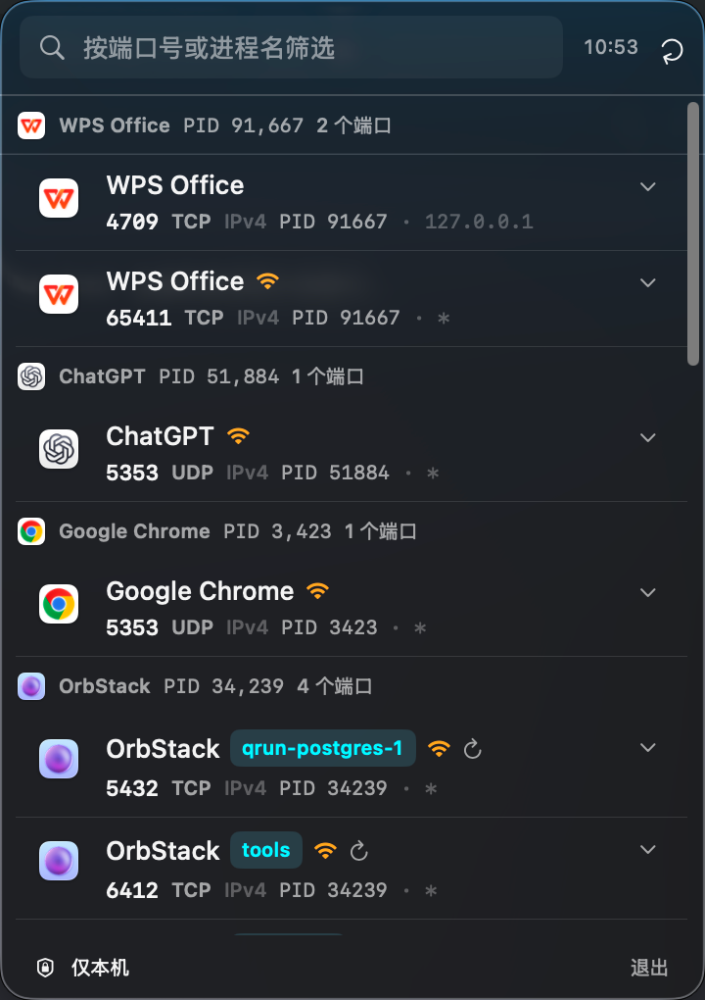

# PortPeek

> 看见那些正在占用你电脑端口的应用。

PortPeek 是一款轻量、原生的 macOS 菜单栏工具，用来查看本机正在监听的 TCP / UDP 端口，并快速找到背后的应用、项目或开发服务。

## 为什么需要 PortPeek？

端口被占用时，你通常只想知道三件事：是谁占用了它、它是否对外开放、我能不能安全地结束它。PortPeek 把这些信息集中在一个随时可打开的小窗口里，不用记命令，也不用在终端里翻查进程。

它尤其适合：

- 本地开发时快速定位“端口已被占用”的原因
- 查看 Docker、OrbStack 和常见开发工具正在使用哪些端口
- 检查某个服务是否绑定到所有网卡、可能对外开放
- 在结束服务前确认应用、PID、项目目录和启动信息

## 核心能力

- 一眼查看当前用户可管理的 TCP / UDP 监听端口
- 按进程分组，快速理解一个应用占用了哪些端口
- 搜索端口号、进程名、地址、协议或 PID
- 识别 Vite、Next.js、Docker、Postgres、Redis 等常见工具与服务
- 展开查看命令行、项目目录、可执行文件、启动时间和父进程
- 标记可能对外暴露的端口，并清晰区分 IPv4 / IPv6
- 支持正常结束和强制结束，危险操作带二次确认
- 常驻菜单栏，后台自动刷新，也支持手动刷新

## 使用体验

打开菜单栏中的 PortPeek，即可看到当前端口列表。点击一条记录查看完整详情，右键可以复制本地地址、打开项目目录，或结束当前用户拥有的进程。

PortPeek 只展示当前用户拥有且可以管理的进程，不会把系统服务和其他用户的进程混在列表中。所有扫描都在本机完成，不上传端口、进程或项目数据。

## 获取 PortPeek

前往 [GitHub Releases](https://github.com/OSpoon/PortPeek/releases) 获取最新版本。项目目前处于持续完善阶段，正式公开分发前可能需要在首次打开时确认 macOS 的安全提示。

如果你希望通过 Homebrew 安装或参与 Cask 发布，请查看[分发说明](docs/HOMEBREW.md)。

## 系统要求

- macOS
- Apple Silicon 或 Intel Mac

PortPeek 使用 macOS 原生菜单栏体验，不会在 Dock 中占据常驻位置。

## 项目文档

面向开发和维护的内容统一放在 [`docs/`](docs/)：

- [开发与构建指南](docs/DEVELOPMENT.md)
- [列表数据流](docs/LIST_DATA_FLOW.md)
- [Homebrew 分发说明](docs/HOMEBREW.md)

## 反馈与贡献

欢迎通过 [Issues](https://github.com/OSpoon/PortPeek/issues) 反馈问题、提出建议或分享你的使用场景。

项目地址：[github.com/OSpoon/PortPeek](https://github.com/OSpoon/PortPeek)
