# RunStat 列表信息获取流程

下面的流程图描述“监听端口列表”从触发刷新到最终展示的完整路径，包含主查询、补漏查询、进程详情、Docker 映射和 SwiftUI 过滤展示。

```mermaid
flowchart TD
    A[触发刷新] --> A1{触发来源}
    A1 -->|PortMonitor.init| B[refresh]
    A1 -->|5 秒 Timer| B
    A1 -->|用户点击刷新| B
    A1 -->|结束进程后轮询| B2[refreshUntilPortChanges]

    B --> C[取消旧 refreshTask\n设置 isRefreshing = true]
    C --> D[异步执行 readListeningPorts]
    B2 --> D2[循环最多 12 次读取\n每次间隔 150ms]
    D2 --> D

    D --> E[后台 Task.detached]
    E --> F[执行 /usr/sbin/lsof\n-nP -iTCP -sTCP:LISTEN -iUDP]
    F --> G{lsof 启动/执行成功?}
    G -->|成功| H[parse lsof 文本]
    G -->|失败| I[主结果为空]

    H --> H1[逐行拆分列\n识别 TCP/UDP、PID、用户、端点]
    H1 --> H2[解析本地地址与端口\n处理 UDP remote endpoint]
    H2 --> H3[按 PID-协议-端口聚合\n合并多个绑定地址]
    H3 --> J[识别 IPv4 / IPv6 / Dual Stack]

    I --> K[parseNetstat]
    J --> K
    K[执行 /usr/sbin/netstat -anv\n解析 tcp4/tcp6/tcp46/udp4/udp6] --> K1[只保留 TCP LISTEN\nUDP 直接保留]
    K1 --> K2[按协议-端口去重]
    K2 --> L[仅补入 lsof 未覆盖的协议-端口]
    J --> L

    H3 --> M[按 PID 获取进程详情]
    L --> M2[若有 PID，按 PID 获取进程详情]
    M --> N[执行 /bin/ps -p PID\n读取 user、PPID、启动时间、command]
    M2 --> N
    N --> O[解析 commandLine\n推断 executablePath]
    O --> P[执行 /usr/sbin/lsof -nP -a -p PID -d cwd,txt -Fn]
    P --> Q[补充工作目录 cwd\n和真实可执行文件 txt]
    Q --> R[生成 ListeningPort 基础记录]
    N --> R
    R --> S[按端口号、命令排序]

    S --> T[serviceName 推断]
    T --> T1[优先按端口映射\n22/80/443/3000/3306/5432/6379/8080/8443]
    T1 --> T2[再按命令关键词推断\nnginx、MySQL、Postgres、Redis 等]

    T2 --> U[可选：查找 Docker 可执行文件]
    U --> V{Docker CLI 可用且 docker ps 成功?}
    V -->|否| W[projectNames = 空映射]
    V -->|是| X[执行 docker ps\n--format 名称与端口映射]
    X --> Y[按 TCP/UDP-端口建立容器名映射\n并建立端口兜底映射]
    W --> Z[合并 lsof + netstat 结果]
    Y --> Z
    Z --> Z1[按协议-端口或端口写入 projectName]
    Z1 --> Z2[过滤系统级记录\n仅保留当前用户且 PID > 1 的端口]
    Z2 --> AA{结果为空且 lsof 失败?}
    AA -->|是| AB[返回空列表 + 权限错误]
    AA -->|否| AC[返回 ScanResult\nports + error=nil]
    E --> AD{Process 异常?}
    AD -->|是| AE[返回空列表 + 扫描失败错误]
    AD -->|否| AA

    D --> AF[回到 MainActor]
    AB --> AF
    AC --> AF
    AE --> AF
    AF --> AG[清理已确认终止的 pending ID]
    AG --> AH[过滤仍在 pendingTerminationIDs 中的记录]
    AH --> AI[发布 listeningPorts、lastError\n设置 isRefreshing = false]

    AI --> AJ[ContentView 响应 @Published]
    AJ --> AK[按 protocolFilter 筛选 TCP / UDP]
    AK --> AL[按搜索词筛选\ncommand、port、address、protocol、PID]
    AL --> AM{是否有匹配记录?}
    AM -->|否| AN[展示空状态或错误状态]
    AM -->|是| AO[ForEach 渲染 PortRow]
    AO --> AP[摘要字段与派生信息\n应用名、图标、协议、IP、PID、目录、徽标]
    AP --> AQ{用户展开详情?}
    AQ -->|是| AR[展示完整字段\n地址、范围、服务、命令、路径、目录、启动时间、用户、父 PID]
    AQ -->|否| AS[保持摘要行]

    %% 领域模型派生信息
    R -.-> AT[ListeningPort 派生属性]
    AT -.-> AT1[displayName：App Bundle / runningApplication / command]
    AT -.-> AT2[executableURL：运行中 App 路径优先\n否则 storedExecutablePath]
    AT -.-> AT3[identityBadge：projectName 优先\n否则命令行/目录关键词识别工具]
    AT -.-> AT4[isExposed / isLaunchdManaged / isRootOrSystemProcess]
    AT1 -.-> AP
    AT2 -.-> AP
    AT3 -.-> AP
    AT4 -.-> AP

    classDef source fill:#e8f1ff,stroke:#4b78b8,color:#102a43;
    classDef process fill:#eef8ee,stroke:#4b8b4b,color:#183b18;
    classDef decision fill:#fff5d9,stroke:#b88900,color:#4a3600;
    classDef output fill:#f4eaff,stroke:#8654b8,color:#2d1745;
    class A,A1,B,B2 source;
    class F,H,H1,H2,H3,K,K1,K2,M,M2,N,O,P,Q,U,X,Y,T,T1,T2,AJ,AK,AL,AO,AP,AR,AS process;
    class G,V,AA,AD,AM,AQ decision;
    class AI,AN,AB,AC,AE,AP,AR output;
```

## 信息来源与字段归属

| 信息 | 主要来源 | 处理位置 |
| --- | --- | --- |
| 协议、端口、绑定地址、PID、进程名、IPv4/IPv6 | `lsof`；缺失时由 `netstat` 补漏 | `parse` / `parseNetstat` |
| 用户、父 PID、启动时间、命令行 | `ps -p PID` | `processDetails` |
| 可执行文件路径、工作目录 | 按 PID 执行 `lsof -d cwd,txt` | `filePaths` |
| 服务名 | 端口号和命令关键词推断 | `serviceName` |
| Docker / OrbStack 项目名 | `docker ps --format ...` 的端口映射 | `dockerProjectNames` + `withProjectName` |
| 应用名、图标、工具徽标、暴露范围、launchd/系统标记 | 已获取字段 + AppKit / `ListeningPort` 派生属性 | `PortModels.swift` |
| 筛选后的列表、展开详情、空状态 | `@Published listeningPorts` | `ContentView` / `PortRow` |

## 关键行为

- `lsof` 是主数据源；`netstat` 只补充 lsof 没有覆盖的“协议-端口”组合，避免重复。
- 系统级、root、其他用户和无有效 PID 的记录在合并后直接丢弃，不进入应用列表。
- 每条 lsof 聚合记录会额外触发一次 `ps` 和一次按 PID 的 `lsof`，因此列表详情是“端口扫描 + 进程信息补全”的组合结果。
- Docker 查询是可选增强：找不到 Docker、daemon 未运行或命令失败时，不影响本机端口列表。
- 刷新会取消上一次未完成的任务；结束进程后会先从界面移除目标记录，再轮询确认它不再出现。
